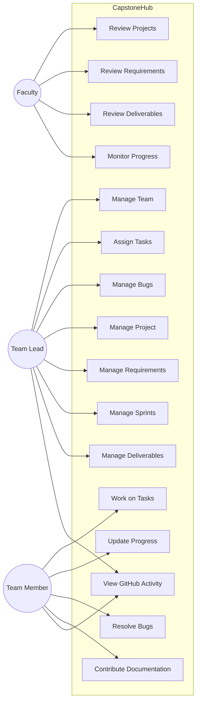
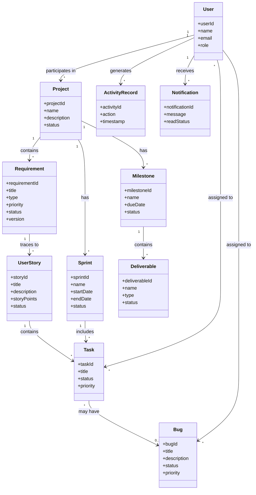
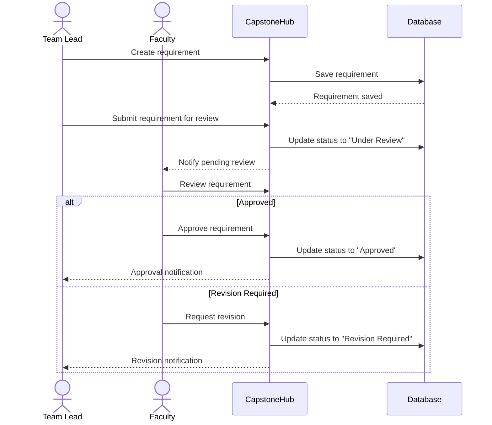
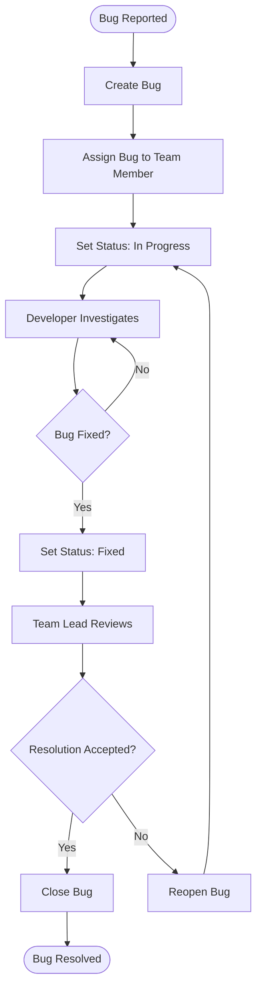
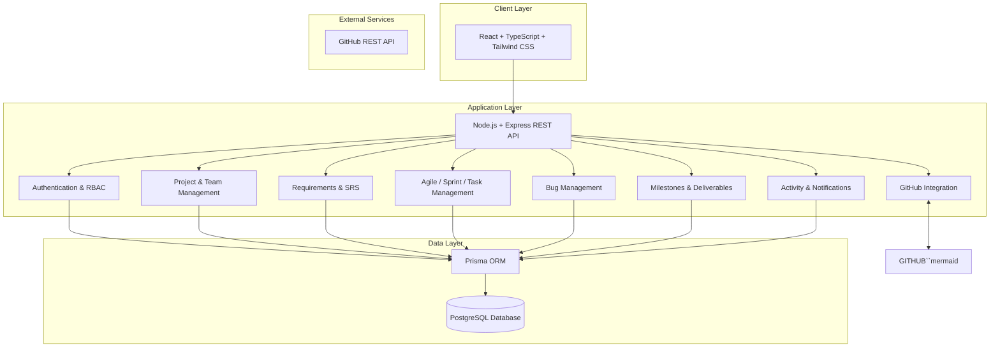
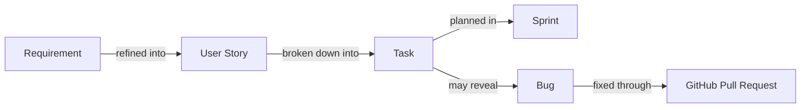

# CapstoneHub

CapstoneHub is a web platform for managing academic software engineering projects. It centralizes requirements/SRS management, Agile planning, tasks and sprints, milestones, deliverables, bugs, faculty review, project activity, notifications, and GitHub activity.

## Core Traceability

```
Requirement → User Story → Task → Sprint → Bug → GitHub Pull Request
```

## Tech Stack

- Frontend: React, TypeScript, Tailwind CSS
- Backend: Node.js, Express, TypeScript
- Database: PostgreSQL 17 Alpine, Prisma ORM
- Testing: Vitest, Playwright
- Deployment: Docker
- Integration: GitHub REST API

## Project Structure

```
capstone-hub/
├── docker-compose.yml
├── package.json
├── README.md
├── backend/
│   ├── prisma/
│   │   ├── migrations/
│   │   └── schema.prisma
│   ├── src/
│   │   ├── config/
│   │   ├── controllers/
│   │   ├── lib/
│   │   ├── middleware/
│   │   ├── routes/
│   │   ├── services/
│   │   ├── app.ts
│   │   └── server.ts
│   ├── tests/
│   ├── package.json
│   └── tsconfig.json
└── frontend/
    ├── src/
    │   ├── components/
    │   ├── pages/
    │   ├── App.tsx
    │   ├── index.css
    │   └── main.tsx
    ├── index.html
    ├── package.json
    ├── postcss.config.js
    ├── tailwind.config.js
    ├── tsconfig.json
    ├── tsconfig.node.json
    └── vite.config.ts
```

## Getting Started

### Prerequisites

- Node.js (>= 18)
- npm (>= 9)
- Docker & Docker Compose

### 1. Database Setup (PostgreSQL 17 Alpine)

Start the PostgreSQL 17 Alpine database container using Docker Compose:

```bash
docker compose up -d
```

To stop the database:

```bash
docker compose down
```

### 2. Dependency Installation

From the root directory:

```bash
npm install
```

### 3. Database Migration

Apply Prisma migrations to the PostgreSQL database:

```bash
npm run db:migrate --workspace=backend
```

To view and manage data in Prisma Studio:

```bash
npm run db:studio --workspace=backend
```

### 4. Running the Development Servers

Run backend (port 5001):

```bash
npm run dev:backend
```

Run frontend (port 5173):

```bash
npm run dev:frontend
```

### 5. Building the Projects

```bash
npm run build
```

### 6. Running Tests

```bash
npm test
```

## UML Diagrams

### 1. Use Case Diagram



### 2. Class Diagram



### 3. Requirement Review — Sequence Diagram



### 4. Bug Lifecycle — Activity Diagram



### 5. System Architecture



### 6. Development Traceability


